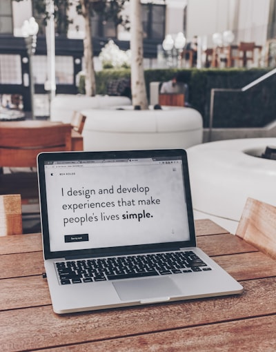

# 視覚とWEBデザインの関係性
### グループ18 | 2E安部 2G寺田

---

## もくじ

> 1. テーマ
> 2. 事前調査の内容
> 3. 実施した実験
> 4. 実験結果と考察
> 5. WEBサイト作成例
> 6. まとめ

---

## テーマ
「視覚とWEBデザインの関係性」
 
#### 具体的には
色覚障害について理解し、そのうえで「どのようなWEBサイトが色覚障害者でも使うことのできるサイトなのか」を探求する。

---

## 事前調査
